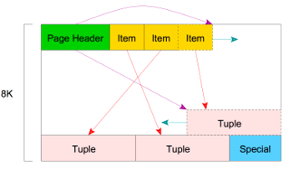
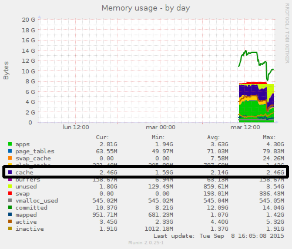
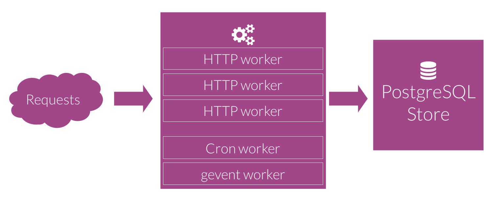
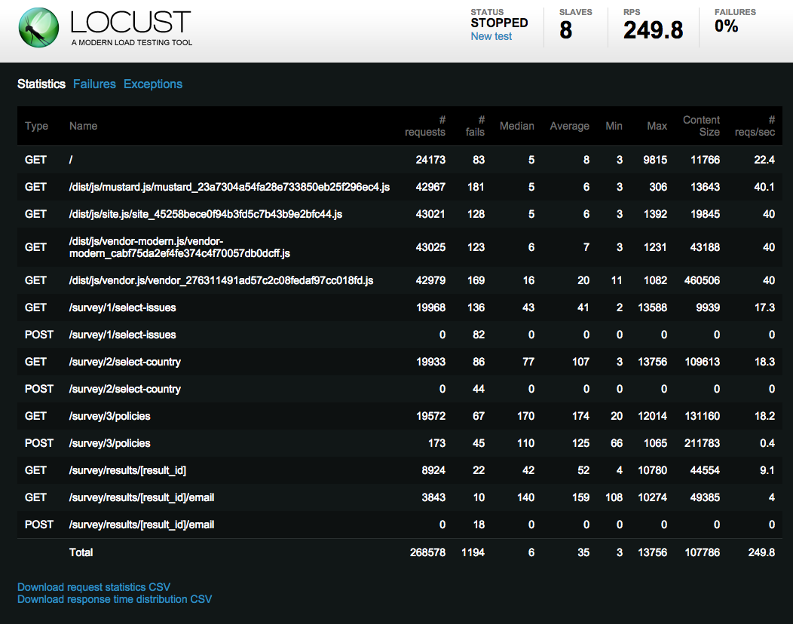

# Handling perf issues

## Introduction

### High performance Odoo

See Olivier Dony's presentation: _ http://www.slideshare.net/openobject/performance2014-35689113 _

> Odoo can handle large data and transaction volumes out of the box!

### Odoo in production

Multi process Odoo (instead of multi thread configuration) is only available on unix. Until now, we assume you've deployed Odoo on a unix system, which is monitored (Munin, sar, ...)
    
> Early optimization is the root of all evil

Donald Knuth

Programmers waste enormous amounts of time thinking about, or worrying about, the speed of **noncritical parts** of their programs, and these attempts at efficiency actually have a **strong negative impact** when debugging and maintenance are considered. 

We should forget about small efficiencies, say about 97% of the time: premature optimization is the root of all evil. Yet we should not pass up our opportunities in that critical 3%.

## Schedule

* Introduction
* Hardware
* Configuration
    * PostgreSQL
    * Odoo
* Reproduce
* Database
* Code

## Performance issues origin

Multiple possible origins :

* **Hardware** issue
* Software **configuration** issue
* Unoptimised **code**
* Unoptimised **database**

First job is to determine **where the issue comes from**. A simple first step is to **check configurations** of Odoo, PostgreSQL and the reverse proxy. Once done, using a cpu monitor tool of your choice, **check if cpu is used by odoo or postgresql**.

Most of the time, it's a mix of Python and SQL...

## Hardware

### Using VM

We do not recommend using VM for various reasons, even if many customers are running successfully on VM's

* Hypervisor not fully mastered
* I/O, Ressource allocation
* Disk bandwidth
* Network bandwidth
* Other VM influence

### VM Encountered issues

* Steal CPU
* CPU, RAM over allocation
* Poor I/O (disk, network)
* Poor throughput (disk, network)


### Sizing

Size accordingly to the needs

* Know the size of the real DB
* Know the # of concurrent users

Roughly

* #CPU = #concurrent_users in peek / 12
* RAM Odoo = #CPU * 2 * (0.9 * 125Mo + 0.1 * 1024)

CPU's are real ones, not hyperthreaded ones.

On VM, enable memory ballooning.

### Monitor

Impossible to handle such issues without knowing ressource usage

* Deploy munin

Munin is very easy to deploy, easy to customize, and some odoo plugins are available <a href="https://github.com/nseinlet/odoo-monitoring/tree/master/etc/munin/plugins">https://github.com/nseinlet/odoo-monitoring/tree/master/etc/munin/plugins</a>

> Monitoring will give unvaluable informations in case of a performance downgrade, hardware failure, ...

## PostgreSQL Configuration

* Size accordingly to db size</li>
* &GT;=**9.6** recommended
* Tune it: http://wiki.postgresql.org/wiki/Tuning_Your_PostgreSQL_Server
* pgtune is a good starting point http://pgtune.leopard.in.ua/
    * work_mem = 64MB

### DB Size

```
SELECT d.datname AS Name, pg_catalog.pg_get_userbyid(d.datdba) AS Owner,
CASE WHEN pg_catalog.has_database_privilege(d.datname, 'CONNECT')
THEN pg_catalog.pg_size_pretty(pg_catalog.pg_database_size(d.datname))
ELSE 'No Access'
END AS Size
FROM pg_catalog.pg_database d
ORDER BY
CASE WHEN pg_catalog.has_database_privilege(d.datname, 'CONNECT')
THEN pg_catalog.pg_database_size(d.datname)
ELSE NULL
END DESC -- nulls first
```

```
name       |  owner   |  size   
---------------+----------+---------
customer1      | nse      | 3509 MB
mydbv9         | nse      | 3483 MB
mydbv8         | nse      | 3001 MB
```

### Table Size (and Toast)</h2>

```
SELECT x.relation, pg_size_pretty(x.total_size) total, pg_size_pretty(x.size) notoast,
pg_size_pretty(x.total_size-x.size) toast, x.num_rows
FROM (
SELECT C.relname AS relation, pg_relation_size(C.oid) AS "size", 
pg_total_relation_size(C.oid) AS "total_size",
S.n_live_tup as num_rows
FROM pg_class C
LEFT JOIN pg_namespace N ON (N.oid = C.relnamespace)
LEFT JOIN pg_stat_user_tables S ON (S.relid=C.oid)
WHERE nspname NOT IN ('pg_catalog', 'information_schema')
AND C.relkind &lt;&gt; 'i'
AND nspname !~ '^pg_toast') x
ORDER BY x.total_size DESC 
LIMIT 20;
```

```
relation         |  total  | notoast |  toast  | num_rows 
--------------------+---------+---------+---------+----------
project_project    | 24 MB   | 112 kB  | 24 MB   |        0
mail_message       | 20 MB   | 12 MB   | 8208 kB |        0
ir_translation     | 14 MB   | 5880 kB | 8400 kB |        0
```

Understanding some concept of PostgreSQL, like Toasts, is a must.



### Number of connections

> This is very important to some of the below parameters (particularly work_mem) because there are some memory resources that are or can be allocated on a per-client basis, so the maximum number of clients suggests the maximum possible memory use

* set db_maxconn in odoo config
* ~4 connections per worker + 3 for admin

### shared_buffers

> The shared_buffers configuration parameter determines how much memory is dedicated to PostgreSQL to use for caching data



* 25% of RAM on physical server</li>
* recommended when in a VM: more than 55% VM RAM (VMWare doc)
* Check munin graph

### effective_cache_size

> effective_cache_size should be set to an estimate of how much memory is available for disk caching[...]

* Should be 50% of the RAM
* 75% of memory is a more aggressive but still reasonable amount

### work_mem</h2>

> If you do a lot of complex sorts, and have a lot of memory, then increasing the work_mem parameter allows PostgreSQL to do larger in-memory sorts which, unsurprisingly, will be faster than disk-based equivalents.


* Use pgtune to determine a value for your config
* work_mem = 64MB is a good start point for Odoo

### autovacuum

A table is vacuumed after having "**autovacuum_vacuum_scale_factor** \* #estimated records in table + **autovacuum_vacuum_threshold**" tuples modified/deleted

Each vacuuming operation cost **credit**. when used credits reach **autovacuum_vacuum_cost_limit**, all vacuuming process are paused for **autovacuum_vacuum_cost_delay** milliseconds.

* Should vacuum more than less
* Increase autovacuum max workers to 5 or 6
* Increase maintenance_work_mem to at least 1GB
* autovacuum vacuum scale factor should be decreased to 0.01 for large tables (this can be set on a per table basis)
* autovacuum vacuum threshold should be increased for small tables

### Good ideas only at first sight

* fsync = false : Can cause data corruption
* autovacuum = false : Transaction ID Wraparound Failures
* track_counts = false : Needed by autovacuum

When vacuuming is painfull, it's better to increase vacuuming. It's easier for the vacuuming process to vacuum less more often rather than vacuuming more less often.

## Odoo Configuration

* Use workers
* set limits
* proxy_mode

> The most common issue is <b>workers=0</b>, which, thanks to GIL, makes Odoo using one single CPU at a time.

### Workers

* 1 worker ~= 6 users
* \# workers = (#cpus * 2 ) + 1



### Limits

* limit_time_cpu
* limit_time_real
* limit_time_real_cron
* limit_memory_hard
* limit_memory_soft
* limit_request

### Proxy_mode</h2>

* proxy_mode = True


        

## Reproduce

* You need a database where you can reproduce the pathological scenario
* Check with dev tools of the browser which call(s) take(s) most of the time
* Identify the method behind the rpc call
* You'll need to reproduce many time the exact same scenario
* There is two kind of scenario: Readonly scenario and Update Scenario
* Readonly are easy, you do not alter the database and are easily to reproduce
* Use the user the smallest right to perform this action, they usually have the most complex record rules

### Update Scenario

* It can be really difficult to reproduce always the same scenario without restoring the same database
* Restore the database and reach the state where you can analyse the slow call can take time
    * Take a backup of the database just before you can launch the call
    * Raise an error at the end of the method. The time taken will be the same but the transaction will be rollback and you'll be able to relaunch right away the same call
    * Of course sometime, you need to check that the result are still correct
    
> You can't control what you can't measure

> Tom DeMarco

### Measure: Timing

* The first measure you can get come from the network tab in chrome: the delay the user gets
* Identify the slowest rpc call
* Measure with time the rpc method call

```
import time
start = time.time()
....
print 'Total Time', time.time() - start
raise ...
```

* The time measure in the method should be similar to waiting time found in network: If not, you are missing something.
* Do not hesitate to take intermediate time measure it will give you a first idea on what is slow.

### Measure: Variance</h3>

* Measure can be different for the same action, launch it many time and take the mean
* If the variance is too high, you machine is doing something else, close it
* When you are trying to improve the performance, make sure the difference with your first measure is significant

### Reproduce RPC calls

The fastest way to reproduce some rpc calls is to scripts them, to be able to launch them on demand.

```
import openerplib

connection = openerplib.get_connection(hostname="localhost", 
                       port=8069, 
                       database="my_db",
                       login="admin", 
                       password="admin", 
                       protocol="jsonrpc",
                       user_id=1)
                       
connection.check_login()

partner_model = connection.get_model('res.partner')
so_model = connection.get_model('sale.order')
product_model = connection.get_model('product.product')

partner_ids = partner_model.search([('name', 'ilike', 'fletcher')])
product_ids = product_model.search([('name', 'ilike', 'ipad')])

order_id = so_model.create({
'partner_id': partner_ids[0],
'order_line': [(0,0,{'product_id': product_ids[0], 'product_uom_qty':1}),
   (0,0,{'product_id': product_ids[1], 'product_uom_qty':2}),],
})
so_model.action_button_confirm([order_id,]) 
```

### Load test the system

To load test the system, you can launch multiple times some rpc scripts, or use a dedicated tool. Locust is one of them, and OdooLocust is syntactic sugar.

```
from locust import task, TaskSet
from OdooLocust import OdooLocust

class SellerTaskSet(TaskSet):
@task(20)
def create_so(self):
    prod_model = self.client.get_model('product.product')
    cust_model = self.client.get_model('res.partner')
    so_model = self.client.get_model('sale.order')
    cust_id = cust_model.search([('name', 'ilike', 'fletch')])[0]
    prod_ids = prod_model.search([('name', 'ilike', 'ipad')])
    order_id = so_model.create({
        'partner_id': cust_id,
        'order_line': [(0,0,{'product_id': prod_ids[0], 'product_uom_qty':1}),
            (0,0,{'product_id': prod_ids[1], 'product_uom_qty':2}), ],
    })
    so_model.action_button_confirm([order_id,])

class Seller(OdooLocust):
    host = "127.0.0.1"
    database = "test_db"
    min_wait = 100
    max_wait = 1000
    weight = 3
    
    task_set = SellerTaskSet
```

Tasks sets can embed other task sets

```
from locust import task, TaskSet

class SellerTaskSet(TaskSet):
    @task(10)
    def read_partners(self):
        cust_model = self.client.get_model('res.partner')
        cust_ids = cust_model.search([])
        prtns = cust_model.read(cust_ids)

    @task(5)
    def read_products(self):
        prod_model = self.client.get_model('product.product')
        ids = prod_model.search([])
        prods = prod_model.read(ids)

    @task(20)
    def create_so(self):
        prod_model = self.client.get_model('product.product')
        cust_model = self.client.get_model('res.partner')
        so_model = self.client.get_model('sale.order')

        cust_id = cust_model.search([('name', 'ilike', 'fletch')])[0]
        prod_ids = prod_model.search([('name', 'ilike', 'ipad')])

        order_id = so_model.create({
        'partner_id': cust_id,
        'order_line': [(0,0,{'product_id': prod_ids[0], 'product_uom_qty':1}),
                   (0,0,{'product_id': prod_ids[1], 'product_uom_qty':2}), ],
        })
        so_model.action_button_confirm([order_id,])
```

Create profiles which use task sets

```
from OdooLocust import OdooLocust
from SellerTaskSet import SellerTaskSet
from BuyerTaskSet import BuyerTaskSet

class Seller(OdooLocust):
    host = "127.0.0.1"
    database = "test_db"
    min_wait = 100
    max_wait = 1000
    weight = 3

    task_set = SellerTaskSet

class Buyer(OdooLocust):
    host = "127.0.0.1"
    database = "test_db"
    min_wait = 100
    max_wait = 1000
    weight = 1

    task_set = BuyerTaskSet
```

### Simulate users
    
* Install requirements
```
$ sudo pip install openerp-client-lib locustio OdooLocust --upgrade
```
* Launch testing service
```
$ locust -f my_file.py Seller Buyer
```
* Use it


<section class="nested">
    <section class="chapter">
        <h1>SQL</h1>
    </section>
    <section>
        <h2>Which queries are running</h2>
        <p>Thanks to the ORM, you have a few control on the executed queries.</p>
        <p>Majority of read queries must be performed in less than 100 ms.</p>
        <p>You can choose to either check in real time the executed queries. With <b>pg_activity</b>, you'll see running queries, blocked ones, ...</p>
        <p>You can also choose to log what's executed and analyse them after. <b>PgBadger</b> is your friend</p>
    </section>
    
    <section>
        <h2>pgActivity</h2>
        <p>PgActivity is one of the tools you can use in production. You have a real-time overview on the running queries, the blocked and blocking ones, ...</p>
        <center></center>
    </section>
    
    <section>
        <h2>Log in postgreSQL...</h2>
        <pre><code>
log_destination = 'csvlog'
logging_collector = on
log_directory = '/var/log/postgresql/pg_log/'
log_filename = 'postgresql-%Y-%m-%d_%H%M%S.log'
log_min_duration_statement = 0
log_line_prefix = '%t [%p-%l] %q%u@%d '
        </code></pre>
        <p>You can also choose to log only queries running in more than 150ms, you'll get only the slowest ones, but maybe miss some slow ones due to the number of time they're executed.</p>
        <pre><code>
log_min_duration_statement = 150
        </code></pre>
        <p>Doing the two is not bad.</p>
    </section>
    
    <section>
        <h2>...To analyse in pgBadger</h2>
        <p>Try to use the github version, more up-to-date than stock distribution one: <a href="https://github.com/dalibo/pgbadger">https://github.com/dalibo/pgbadger</a></p>
        <pre><code>
pgbadger /var/log/postgresql/pg_log/*.csv -f csv
        </code></pre>
        <center></center>
    </section>
    <section>
        <h2>Being able to read a query plan</h2>
        <pre><code class="sql">
EXPLAIN ANALYSE [myquery]
        </code></pre>
        <p><a href="https://explain.depesz.com/">https://explain.depesz.com/</a> is your friend.</p>
        <p><table><tr><td>
            
        </td><td>
            
        </td></tr></table>
        <p>Each node is a link to the explaination of what is the node kind (nested loop, Hash, ...)</p>
    </section>
    
    <section>
        <h3>Index in odoo</h3>
        <ul>
            <li>you can add a btree index (<a href="https://www.postgresql.org/docs/9.5/static/indexes-types.html">the default in postgresql</a>), by simply add index=True at the field definition</li>
            <li>You maybe need (in rare case, PostgreSQL is able to combine indices) to add custom type of index or index on more then one field at the same type</li>
            <li>Use the init method to declare them</li>
            <pre><code class="python" data-trim>
#Example on mail.message, index on two fields
@api.model_cr
def init(self):
self._cr.execute("""
SELECT indexname FROM pg_indexes 
WHERE indexname = 'mail_message_model_res_id_idx'
""")
if not self._cr.fetchone():
self._cr.execute("""
CREATE INDEX mail_message_model_res_id_idx 
ON mail_message (model, res_id)
""")
            </code></pre>
        </ul>
    </section>
    
    <section>
        <h3>Auto join</h3>
        <ul>
            <li>Make a join when searching for subfield instead of two select</li>
            <li>you can find more details <a href="http://odoo-docs.readthedocs.io/en/latest/06_misc_auto_join.html">http://odoo-docs.readthedocs.io/en/latest/06_misc_auto_join.html</a></li>
            <li>Problem 1: using auto_join bypasses the business logic; no name search is performed, only direct matches between ids using join conditions</li>
            <li>Problem 2: ir.rules are not taken into account when analyzing and adding the join conditions</li>
            <pre><code class="python" data-trim>
#See there is two query, one on sale.order.line and one on analytic line
self.env['account.analytic.line'].search([('so_line.name', '=', 'Consultant')])
#Now add auto_join on the field so_line
self.env['account.analytic.line'].search([('so_line.name', '=', 'Consultant')])
#Only one query
            </code></pre>
        </ul>
    </section>
    
</section>

</section>

<section class="nested">
    <section class="chapter">
        <h1>Code</h1>
    </section>
    <section>
        <h2>Which code is executed</h2>
        <p>Send a kill -3 to the process, the stack trace will be outputed on stdout of the Odoo process.<p>
        <p>If process is often in the same piece of code, you've located a starting point for your code investigation.</p>
    </section>
    <section>
        <h2>Measure CPU usage</h2>
        <ul>
            <li>htop<br/>
                
            </li>
            <li>atop<br/>
                
            </li>
        </ul>
    </section>
    <section>
        <h2>Measure I/O</h2>
        <ul><li>vmstat</li></ul>
        <pre><code  class="bash" data-trim>
$ vmstat -w 2
procs ---------------memory-------------- ---swap-- -----io---- -system-- ------cpu-----
r  b     swpd     free     buff    cache   si   so    bi    bo   in   cs us sy id wa st
0  0        0  3990736  1434980  5438008    0    0    71   152  257  251  9  2 88  1  0
0  0        0  3990136  1434984  5438044    0    0     0    74  703 3098  3  1 96  0  0
0  0        0  3989488  1434996  5438052    0    0     0   336  947 3822  3  1 96  1  0
0  0        0  3987196  1434996  5438464    0    0     0    88  781 3406  5  1 94  0  0
        </code></pre>
        <ul><li>iotop</li></ul>
        <pre><code  class="bash" data-trim>
Total DISK READ :       0.00 B/s | Total DISK WRITE :      42.21 K/s
Actual DISK READ:       0.00 B/s | Actual DISK WRITE:     161.18 K/s
TID  PRIO  USER     DISK READ  DISK WRITE  SWAPIN     IO>    COMMAND                                                                                                                                                           
159 be/3 root        0.00 B/s   11.51 K/s  0.00 %  1.78 % [jbd2/sda3-8]
3843 be/4 root        0.00 B/s    0.00 B/s  0.00 %  0.09 % X :0 -audit 0 -auth /var/lib/mdm/:0.Xauth -nolisten tcp vt8
4844 be/4 nse         0.00 B/s    0.00 B/s  0.00 %  0.02 % chrome [Chrome_FileThre]
5123 be/4 nse         0.00 B/s   15.35 K/s  0.00 %  0.00 % nacl_helper
2185 be/4 root        0.00 B/s    7.68 K/s  0.00 %  0.00 % rsyslogd [rs:main Q:Reg]
4848 be/4 nse         0.00 B/s    7.68 K/s  0.00 %  0.00 % chrome [Chrome_IOThread]
1 be/4 root        0.00 B/s    0.00 B/s  0.00 %  0.00 % init [2]
        </code></pre>
        <ul><li>strace</li></ul>
    </section>
    
</section>
<section class="nested">
    <section class="chapter">
        <h1>Code profiling</h1>
    </section>
    <section>
        <h2>Profiling a piece of code</h2>
        <pre><code  class="python" data-trim>
from openerp.tools.misc import profile

[...]
@profile('/temp/prof.profile')
@api.multi
def mymethod(...)
        </code></pre>
        <pre><code>
gprof2dot -f pstats -o /temp/prof.xdot /temp/prof.profile
xdot /temp/prof.xdot
        </code></pre>
    </section>
    <section>
        <h2>Profiling result</h2>
        <ul>
<li>total time % is the percentage of the running time spent in this function and all its children;</li>
<li>self time % is the percentage of the running time spent in this function alone;</li>
<li>total calls is the total number of times this function was called (including recursive calls).</li>
<li>An edge represents the calls between two functions.</li>
</ul>
    </section>
    <section>
        <h2>Profiling graph</h2>
<center></center>
    </section>
    <section>
        <h2>Profiling using plop and flamegraph</h2>
        <ol><li>Prerequisites
        <pre><code  class="bash" data-trim>
$ sudo pip install plop
$ git clone git@github.com:brendangregg/FlameGraph.git
        </code></pre></li>
        <li>Run odoo with profiling enabled
        <pre><code  class="bash" data-trim>
python -m plop.collector -f flamegraph odoo.py -c my_config_file
        </code></pre></li>
        <li>Render svg from flamegraph data
        <pre><code class="bash" data-trim>
flamegraph.pl profiles/odoo.py-44.flame > res.svg
        </code></pre></li></ol>
    </section>
    <section>
        <h2>Flamegraph result</h2>
<center></center>
    </section>
    
</section>
<section class="nested">
    
    <section class="chapter">
        <h1>Understand the ORM and optimize</h1>
    </section>
    <section>
        <h3>Search</h3>
        <ul>
            <li>A common mistake is a search in a loop: <pre><code class="python" data-trim>
For record in self:
self.env['other_object'].search([('link_id', '=', object.id)])
            </code></pre></li>
            <li>Store your result in a dictionnaries</li>
            <li>Search is better than filtered and sorted: <pre><code class="python" data-trim>
#No
self.env['other_object'].search([]).filtered(lamba x: x.state=='done').sorted(key=lambda r: r.date)[:80]

#Better
self.env['other_object'].search([('state', '=', 'done')], order='date asc', limit=80)
            </code></pre></li>
            <li>Filtered is good if you need all the data but for different purpose, or on a O2M: <pre><code class="python" data-trim>
#No
for record in self:
env['other.model'].search(['&amp', ('previous_model_id', '=', record.id), ('state', '=', 'done')])

#Yes
for record in self:
record.other_model_ids.filtered(lamba x: x.state=='done')
            </code></pre></li>
        </ul>
    </section>
    <section>
        <h3>Read</h3>
        <ul>
            <li>Rarely use directly, call through recordset.field</li>
            <li>There is a cache per env</li>
            <li>Changing the user, the context or the cursor will change the env and thus you'll change the cache.</li>
            <pre><code class="python" data-trim>
#First query
self.env['res.partner'].search([]).mapped('name')
#No cache
self.env['res.partner'].sudo().search([]).mapped('name')
#Still no cache
self.env['res.partner'].search([]).with_context(test=True).mapped('name')
#Total = 3 queries
            </code></pre>
            <li>Any modification of a record invalid the cache for this record</li>
            <pre><code class="python" data-trim>
titles = self.env['res.partner.title'].search([]
titles.mapped('name')
titles[0].write({'name' : 'Madame'})
titles.mapped('name')
            </code></pre>
        </ul>
    </section>
    <section>
        <h3>Prefetch</h3>
        <ul>
            <li>When you access access with . or mapped, the system will check in the cache, if the information is not in the cache, all the stored fields from the current recordset are prefetched.</li>
            <li>This is not the case when you use read directly</li>
<pre><code class="python" data-trim>
self.env['res.users'].search([]).read(['login'])
self.env['res.users'].search([]).mapped('password')
</code></pre>
            <li>all the stored fields with <b>prefetch=True</b> are prefetched, only the binary have prefetch=False by default</li>
            
        </ul>
    </section>
    <section>
        <h3>Disable Prefetch</h3>
        <ul>
            <li>You can disable prefetching with prefetch_fields=False in the context</li>
            <li>It's only a good idea when you have an object with lot of field end you need only few of them for your computation</li>
            <li>Be carefull dot access of 2 fields will trigger two select query</li>
            <li>Use read to fetch at once only the field you need, and then feel free to use the dot access</li>
        </ul>
        <pre><code class="python" data-trim>
#No
line = self.env['account.analytic.line'].with_context(prefetch_fields=False).search([])
line.mapped('amount')
line.mapped('amount_currency')

#Better
line = self.env['account.analytic.line'].with_context(prefetch_fields=False).search([])
line.read(['amount', 'amount_currency'])
line.mapped('amount')
line.mapped('amount_currency')
        </code></pre>
    </section>
    <section>
        <h3>Write</h3>
        <ul>
            <li>One write can hide another one or several: <a href="https://github.com/odoo/odoo/blob/10.0/addons/sale/models/sale_analytic.py#L121">Example</a></li>
            <li>Avoid at any cost to loop inside the redefinition of a write, at least avoid it each time you can, filter the case where it's really needed like</li>
            <li>Computed field store may be trigger: Check in _write</li>
            <li>Assignation trigger a write
            <pre><code class="python" data-trim>
#Slower -> 2 update queries
rec.field1 = value1 
rec.field2 = value2

#Faster -> 1 update query
rec.write({'field1': value1, 'field2': value2})
            </code></pre></li>
            <li>Write as much field at the same time and on much object at the same time
            <pre><code class="python" data-trim>
#n update queries
for record in self:
record.write({'field1': value1, 'field2': value2})

#1 update query
self.write({'field1': value1, 'field2': value2})
            </code></pre></li>
            <li>Not always possible when you write different value on each record</li>
            <li>But sometimes they are not all different, only few different value</li>
            <li>It make sense to group record per value to write before writing the value</li>
        </ul>
    </section>
    <section>
        <h3>_batch_write and _flush</h3>
        <ul>
            <li>Group similar write to execute the write with a batch of record</li>
        
        <pre><code class="python" data-trim>
#253 records, 253 write
country =  self.env['res.country'].search([])
for rec in country:
rec.write({'phone_code': random.randint(1,10)}) 
#253 records, 10 write max, 10 possible value
for rec in country:
rec._batch_write({'phone_code': random.randint(1,10)})
country._flush()
#253 record, 100 Possible Value, 100 write max
for rec in country:
rec._batch_write({'phone_code': random.randint(1,10),
         'currency_id': random.randint(3,13)})
country._flush() 
#2 Step: 20 Write max
for rec in country:
rec._batch_write({'phone_code': random.randint(1,10)})
country._flush() 
for rec in country:
rec._batch_write({'currency_id': random.randint(3,13)})
country._flush() 
#But if value are linked, only 10 write
for rec in country:
rnd = random.randint(1,10)
rec._batch_write({'phone_code': rnd, 'currency_id': rnd + 2})
country._flush() 
        </code></pre> 
            <li>Worse case: as much write as the number of record same as using write
            <li>_batch_write store the value to write on the env, don't change env before the flush</li>
        </ul>

    </section>
    <section>
        <h3>Computed Field</h3>
        <ul>
            <li>Non stored field need to be recomputed at each read, but they are stored in the cache<li>
            <li>Stored fields are triggered each time one of the dependency is updated even if it's with the same value</li>
            <li>recompute=False in the context disable the update of stored computed field: good idea when you write on lot of records that trigger modifications on the same record</li>
            <li>Do not forget to call self.recompute() at least at the end of the transaction or when you need it</li>
            <li>Even when you have set recompute=False, the modification of field in a depends will trigger a search to mark the record and field as "to recompute", only if the depends is on another object</li>
            <li>Stored field has a high cost during modification, store the field only if you need it and maybe sometimes it's better to define it as a normal field and compute the value manually when needed</li>
        </ul>
    </section>
</section>
